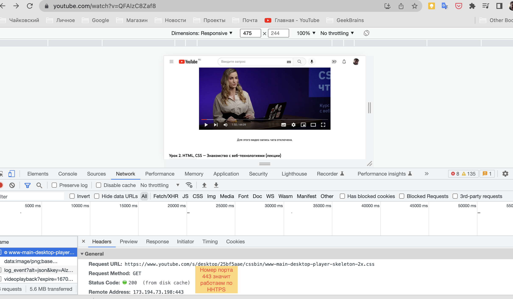
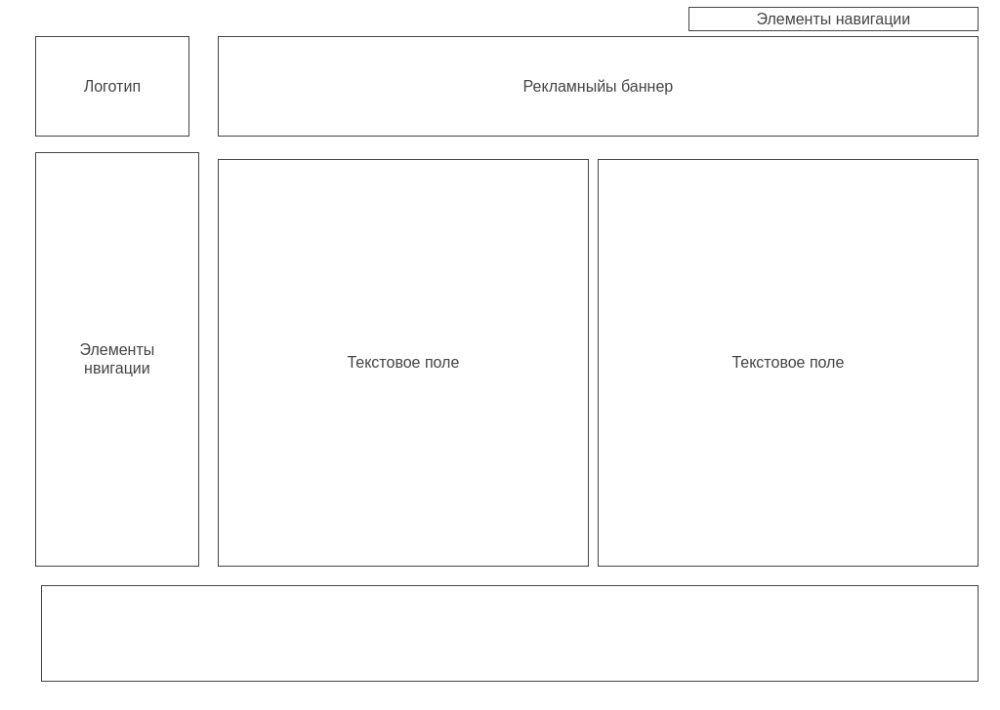
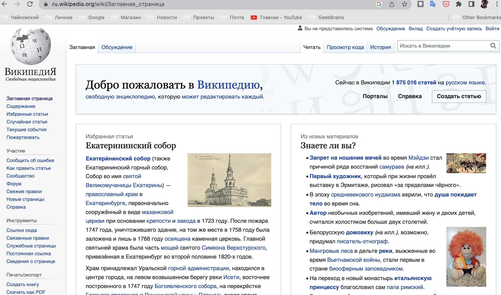
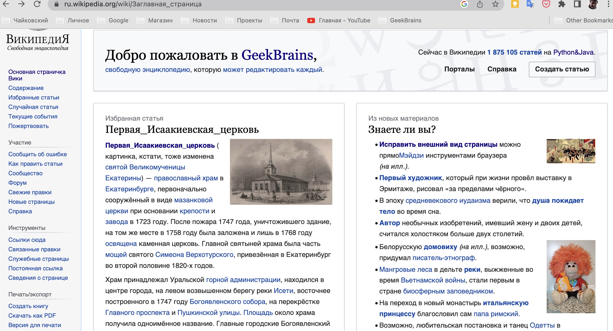
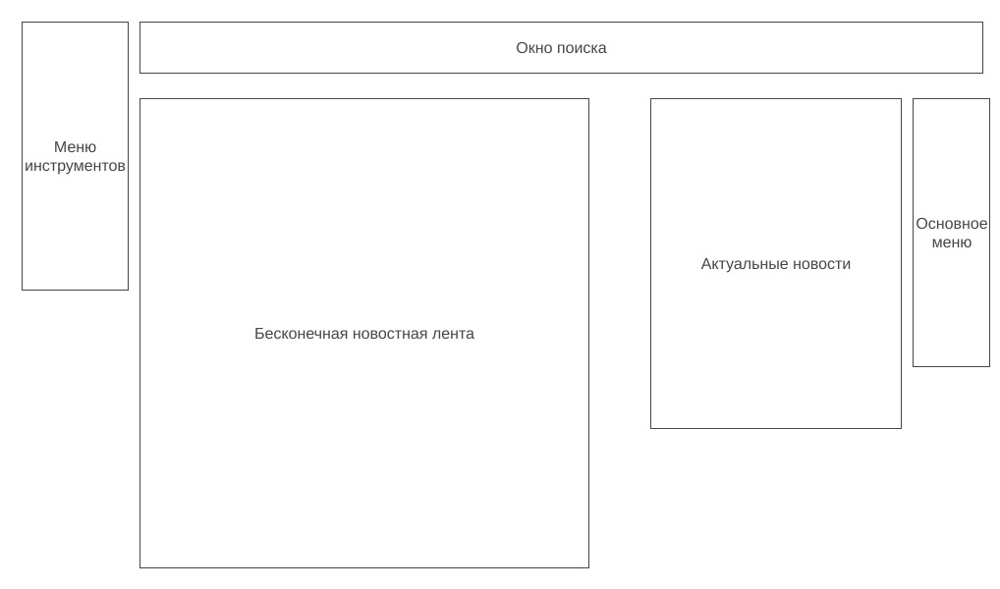

# Урок 1. Веб-технологии: вчера, сегодня, завтра

Формат сдачи ДЗ - один архив, со всеми файлами и скриншотами, либо pull request на github.

## Задание 1. 

Определите, на каком протоколе работает сайт youtube.com.
Сделайте скриншот с названием 1_protocol.jpg, по которому станет понятно, как вы определили протокол сайта.

## Решение 1. 

Ютюб работает с протоколом HTTPS.

## Задание 2. 

2. Создайте файл 2_analyze.txt, в котором проанализируйте структуру страницы сайта https://ru.wikipedia.org/, а именно нужно описать (коротко, своими словами), какие блоки есть на сайте, что в этих блоках находится. Есть ли на сайте шапка, подвал, что в них содержится? Как и где расположен контент? Есть ли дополнительные элементы на странице?

Представьте, что вы описываете сайт дизайнеру или разработчику и пытаетесь объяснить на словах, из чего будет состоять сайт, какие в нем будут основные блоки. Нас не должны интересовать теги или классы в html, какие-либо мелкие детали сайта, все это детали реализации, которые будут приниматься программистом и дизайнером. Интересует то, как вы опишите словами сайт, чтобы разработчик и дизайнер поняли, с чем им предстоит работать.

## Решение 2. 

В правом верхнем углу как на большинстве сайтов расположены
кнопки регистрации и логина.
Далее мы имеем левую панель, 
включающую логотип 
(он же кнопка возврата в галвное окно сайта)
и множество элементов навигации.
По центру расположен лист оформленный в виде закладок, 
где на каждой раположено текстовое поле.
Основное (заглавное)поле разбито на две колонки.
Каждая закладка имеет свой вид, отличный от соседней 
(ощущение, что делали разные команды разных поколений).
Внизу Основного поля имеется псевдоподвал (подвал основного поля),
где собраны красиво оформленные ссылки на всю экосистему Вики.
Внизу страницы имеется подвал, в который включены классические атрибуты сайта и разработчиков.

)
## Задание 3. 

Внесите не менее 10 изменений на страницу любой статьи сайта https://ru.wikipedia.org/, с помощью инструмента разработчика и представьте два скриншота было/стало (скриншоты должны иметь названия 3_before.jpg, 3_after.jpg соответственно). Желательно поработать с изменением текста на странице, заменой картинки, изменением стилей.

## Решение 3. 
Найдите 10 отличий :)

## Задание 4. 

4. Создайте прототип низкой детализации сайта https://dzen.ru/ с помощью сайта https://wireframe.cc/. Предоставьте скриншот того, что получилось (скриншот должен быть назван 4_proto.jpg).

## Решение 4. 

_Примечание к работе:_

_Расширение картинки не обязательно должно быть .jpg, подойдет любое из популярных расширений для картинок._

_Обычные текстовые файлы необходимо создать с кодировкой UTF-8, это стандартная кодировка, с которой создаются файлы в vscode._